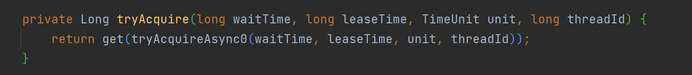
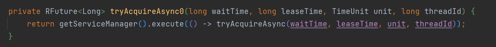

# Redisson分布锁实现

## lock()源码分析

`lock()`是由`RedissonLock`类实现的方法，查看源码


调用了**private void lock(long leaseTime, TimeUnit unit, boolean interruptibly)** 重载方法

```java
private void lock(long leaseTime, TimeUnit unit, boolean interruptibly) throws InterruptedException {
    long threadId = Thread.currentThread().getId();
    Long ttl = tryAcquire(-1, leaseTime, unit, threadId);
    // lock acquired
    if (ttl == null) {
        //获取锁成功，结束方法
        return;
    }

    //异步订阅解锁消息
    CompletableFuture<RedissonLockEntry> future = subscribe(threadId);
    // 设置定时任务，达到超时处理
    // 定时任务内容为，订阅解锁消息的任务 没完成抛出指定异常
    // 如果定时任务启动前 完成的话会取消这个定时任务
    pubSub.timeout(future);

    //阻塞等待解锁消息
    RedissonLockEntry entry;
    if (interruptibly) {
        //可中断
        entry = commandExecutor.getInterrupted(future);
    } else {
        //不可中断，阻塞等待
        entry = commandExecutor.get(future);
    }


    try {
        //不断尝试获取锁 知道产生中断或者获取到锁
        while (true) {
            ttl = tryAcquire(-1, leaseTime, unit, threadId);
            // lock acquired
            if (ttl == null) {
                break;
            }

            // waiting for message
            // 没有获取到锁，会阻塞ttl的时间，期间如果锁被释放，或者当前线程被中断，或者阻塞时间到了，再继续
            if (ttl >= 0) {
                try {
                    entry.getLatch().tryAcquire(ttl, TimeUnit.MILLISECONDS);
                } catch (InterruptedException e) {
                    if (interruptibly) {
                        throw e;
                    }
                    entry.getLatch().tryAcquire(ttl, TimeUnit.MILLISECONDS);
                }
            } else {
                if (interruptibly) {
                    entry.getLatch().acquire();
                } else {
                    entry.getLatch().acquireUninterruptibly();
                }
            }
        }
    } finally {
        //最终释放订阅
        unsubscribe(entry, threadId);
    }
}
```

**tryAcquire(long waitTime, long leaseTime, TimeUnit unit, long threadId)**，参数分别为超时时间、锁过期时间、时间单位、当前尝试获取锁id



**tryAcquireAsync0(long waitTime, long leaseTime, TimeUnit unit, long threadId)**



尝试获取锁

如果lock()方法没有设置过期时间，默认leaseTime为-1，可以从述代码中看到，没有设置过期时间，会默认传入`internalLockLeaseTime`值为30000ms

```java
private RFuture<Long> tryAcquireAsync(long waitTime, long leaseTime, TimeUnit unit, long threadId) {
    RFuture<Long> ttlRemainingFuture;
    if (leaseTime > 0) {
        //用户设置了过期时间
        ttlRemainingFuture = tryLockInnerAsync(waitTime, leaseTime, unit, threadId, RedisCommands.EVAL_LONG);
    } else {
        //用户未设置过期时间,默认使用internalLockLeaseTime，初始值为30000ms
        ttlRemainingFuture = tryLockInnerAsync(waitTime, internalLockLeaseTime,
                                               TimeUnit.MILLISECONDS, threadId, RedisCommands.EVAL_LONG);
    }
    CompletionStage<Long> s = handleNoSync(threadId, ttlRemainingFuture);
    ttlRemainingFuture = new CompletableFutureWrapper<>(s);

    CompletionStage<Long> f = ttlRemainingFuture.thenApply(ttlRemaining -> {
        // lua执行结果 获取为null 说明加锁成功
        if (ttlRemaining == null) {
            if (leaseTime > 0) {
                // 成功后，如果用户未设置过期时间，更新internalLockLeaseTime为用户设定时间
                // 保证重入锁并且用户未设置过期时间时延用初始的过期时间
                internalLockLeaseTime = unit.toMillis(leaseTime);
            } else {
                // 设置定时任务，按过期时间的1/3时间频率续期，续期时间值 internalLockLeaseTime 决定
                scheduleExpirationRenewal(threadId);
            }
        }
        return ttlRemaining;
    });
    return new CompletableFutureWrapper<>(f);
}
```

获取锁底层使用的lua脚本，将获取锁对象时的name参数作为KEYS传入，过期时间和当前线程标识作为ARGV传入；

```java
<T> RFuture<T> tryLockInnerAsync(long waitTime, long leaseTime, TimeUnit unit, long threadId, RedisStrictCommand<T> command) {
    return evalWriteSyncedAsync(getRawName(), LongCodec.INSTANCE, command,
                                "if ((redis.call('exists', KEYS[1]) == 0) " +
                                "or (redis.call('hexists', KEYS[1], ARGV[2]) == 1)) then " +
                                "redis.call('hincrby', KEYS[1], ARGV[2], 1); " +
                                "redis.call('pexpire', KEYS[1], ARGV[1]); " +
                                "return nil; " +
                                "end; " +
                                "return redis.call('pttl', KEYS[1]);",
                                Collections.singletonList(getRawName()), unit.toMillis(leaseTime), getLockName(threadId));
}
```

```lua
KEYS[1] -- key
ARGV[1] -- 过期时间
ARGV[2] -- field 线程标识

if (redis.call('exists', KEYS[1]) == 0) 
    or (redis.call('hexists', KEYS[1], ARGV[2]) == 1)) then -- 锁如果不存在 或者 锁存在并且是当前线程的(通过查看key、feild对应的value是否存在)
    redis.call('hincrby', KEYS[1], ARGV[2], 1);		-- 将hash结构的value增1，即重入次数+1
    redis.call('pexpire', KEYS[1], ARGV[1]);		-- 设置过期时间
    return nil;										-- 返回nil
end;
return redis.call('pttl', KEYS[1]);					-- 锁存在 且 不是的当前线程的 获取锁失败 返回锁的剩余过期时间
```

获取锁成功后，如果未设置过期时间会通过`scheduleExpirationRenewal`开启了定时任务续期

```java
private void renewExpiration() {
    ExpirationEntry ee = EXPIRATION_RENEWAL_MAP.get(getEntryName());
    if (ee == null) {
        return;
    }
	// 内部使用 HashedWheelTimer的newTimeout 开启 定时任务 internalLockLeaseTime/3 毫秒后 执行一次TimerTask内容
    Timeout task = getServiceManager().newTimeout(new TimerTask() {
        @Override
        public void run(Timeout timeout) throws Exception {
            ExpirationEntry ent = EXPIRATION_RENEWAL_MAP.get(getEntryName());
            if (ent == null) {
                return;
            }
            Long threadId = ent.getFirstThreadId();
            if (threadId == null) {
                return;
            }
			//开启异步续期
            CompletionStage<Boolean> future = renewExpirationAsync(threadId);
            future.whenComplete((res, e) -> {
                if (e != null) {
                    log.error("Can't update lock {} expiration", getRawName(), e);
                    EXPIRATION_RENEWAL_MAP.remove(getEntryName());
                    return;
                }

                if (res) {
                    // reschedule itself
                    // 每次续期任务执行后，又会调用该方法创建好下一次的定时续期任务，达到不断续期效果
                    renewExpiration();
                } else {
                    cancelExpirationRenewal(null, null);
                }
            });
        }
    }, internalLockLeaseTime / 3, TimeUnit.MILLISECONDS);

    ee.setTimeout(task);
}
```

续期底层调用`RedissonBaseLock`的`renewExpirationAsync`方法

```java
protected CompletionStage<Boolean> renewExpirationAsync(long threadId) {
    return evalWriteSyncedAsync(getRawName(), LongCodec.INSTANCE, RedisCommands.EVAL_BOOLEAN,
            "if (redis.call('hexists', KEYS[1], ARGV[2]) == 1) then " +
                    "redis.call('pexpire', KEYS[1], ARGV[1]); " +
                    "return 1; " +
                    "end; " +
                    "return 0;",
            Collections.singletonList(getRawName()),
            internalLockLeaseTime, getLockName(threadId));
}
```

## tryLock()源码分析

不带参数的`tryLock()`方法，最终通过`tryAcquireOnceAsync`方法，该方法和`tryAcquireAsync`类似，只是改方法只给`tryLock()`使用，并且都是没有自定义过期时间的参数

获取锁还是调用的和lock方法一样的`tryLockInnerAsync`方法，

`tryLock()`方法内部没有重试，直接返回获取锁的成功与否。

```java
@Override
public boolean tryLock() {
    return get(tryLockAsync());
}

@Override
public RFuture<Boolean> tryLockAsync(long threadId) {
    return getServiceManager().execute(() -> tryAcquireOnceAsync(-1, -1, null, threadId));
}


private RFuture<Boolean> tryAcquireOnceAsync(long waitTime, long leaseTime, TimeUnit unit, long threadId) {
    CompletionStage<Boolean> acquiredFuture;
    if (leaseTime > 0) {
        acquiredFuture = tryLockInnerAsync(waitTime, leaseTime, unit, threadId, RedisCommands.EVAL_NULL_BOOLEAN);
    } else {
        acquiredFuture = tryLockInnerAsync(waitTime, internalLockLeaseTime,
                                           TimeUnit.MILLISECONDS, threadId, RedisCommands.EVAL_NULL_BOOLEAN);
    }

    acquiredFuture = handleNoSync(threadId, acquiredFuture);

    CompletionStage<Boolean> f = acquiredFuture.thenApply(acquired -> {
        // lock acquired
        if (acquired) {
            if (leaseTime > 0) {
                internalLockLeaseTime = unit.toMillis(leaseTime);
            } else {
                scheduleExpirationRenewal(threadId);
            }
        }
        return acquired;
    });
    return new CompletableFutureWrapper<>(f);
}
```

再来看一下带参数的tryLock(long waitTime, long leaseTime, TimeUnit unit)，大致逻辑和lock一致，增加了 锁重试时间的限制，来避免不断重试获取锁的开销

```java
@Override
public boolean tryLock(long waitTime, long leaseTime, TimeUnit unit) throws InterruptedException {
    //重试等待时间
    long time = unit.toMillis(waitTime);
    //当前时间
    long current = System.currentTimeMillis();
    long threadId = Thread.currentThread().getId();
    //获取锁，和lock调用相同的方法
    Long ttl = tryAcquire(waitTime, leaseTime, unit, threadId);
    // lock acquired
    if (ttl == null) {
        // 获取到锁 返回true
        return true;
    }
    //更新等待时间 原重试等待时间 - 上面获取锁代码耗时
    time -= System.currentTimeMillis() - current;
    if (time <= 0) {
        //如果超过了重试等待时时间 返回获取锁失败结果 false
        acquireFailed(waitTime, unit, threadId);
        return false;
    }

    //再次获取时间
    current = System.currentTimeMillis();
    //订阅解锁消息
    CompletableFuture<RedissonLockEntry> subscribeFuture = subscribe(threadId);
    try {
        //阻塞等待解锁消息，阻塞时间就是剩余的等待时间
        subscribeFuture.get(time, TimeUnit.MILLISECONDS);
    } catch (TimeoutException e) {
        // get阻塞时间到了任务还未完成 抛出TimeoutException
        // completeExceptionally 如果任务未完成 将任务变为完成状态 并且结果是抛出指定异常；
        // 如果completeExceptionally的转变完成状态成功，返回true，否则false
        // 此处如果转变完成状态时任务刚好完成了，那就false if条件成立，随后取消订阅
        if (!subscribeFuture.completeExceptionally(new RedisTimeoutException(
            "Unable to acquire subscription lock after " + time + "ms. " +
            "Try to increase 'subscriptionsPerConnection' and/or 'subscriptionConnectionPoolSize' parameters."))) {
            subscribeFuture.whenComplete((res, ex) -> {
                if (ex == null) {
                    //取消订阅
                    unsubscribe(res, threadId);
                }
            });
        }
        acquireFailed(waitTime, unit, threadId);
        return false;
    } catch (ExecutionException e) {
        LOGGER.error(e.getMessage(), e);
        acquireFailed(waitTime, unit, threadId);
        return false;
    }

    try {
        //再次更新重试等待时间，并查看
        time -= System.currentTimeMillis() - current;
        if (time <= 0) {
            acquireFailed(waitTime, unit, threadId);
            return false;
        }
        //持续获取锁，知道获取锁成功 或者 重试时间超时
        while (true) {
            long currentTime = System.currentTimeMillis();
            ttl = tryAcquire(waitTime, leaseTime, unit, threadId);
            // lock acquired
            if (ttl == null) {
                return true;
            }

            time -= System.currentTimeMillis() - currentTime;
            if (time <= 0) {
                acquireFailed(waitTime, unit, threadId);
                return false;
            }

            // waiting for message
            // 重试中，还通过阻塞锁剩余ttl 来避免线程不必要的尝试造成性能浪费
            currentTime = System.currentTimeMillis();
            if (ttl >= 0 && ttl < time) {
                commandExecutor.getNow(subscribeFuture).getLatch().tryAcquire(ttl, TimeUnit.MILLISECONDS);
            } else {
                commandExecutor.getNow(subscribeFuture).getLatch().tryAcquire(time, TimeUnit.MILLISECONDS);
            }

            time -= System.currentTimeMillis() - currentTime;
            if (time <= 0) {
                acquireFailed(waitTime, unit, threadId);
                return false;
            }
        }
    } finally {
        unsubscribe(commandExecutor.getNow(subscribeFuture), threadId);
    }
}
```

## unlock()源码分析

unlock()是`RedissonLock`的父类`RedissonBaseLock`的方法，底层解锁处理由`RedissonLock`的`unlockInnerAsync`方法实现

unlock() -> unlockAsync() -> unlockAsync0() -> unlockInnerAsync(long threadId) -> unlockInnerAsync(long threadId, String requestId, int timeout)

```java
@Override
public void unlock() {
    try {
        get(unlockAsync(Thread.currentThread().getId()));
    } catch (RedisException e) {
        if (e.getCause() instanceof IllegalMonitorStateException) {
            throw (IllegalMonitorStateException) e.getCause();
        } else {
            throw e;
        }
    }
}


@Override
public RFuture<Void> unlockAsync(long threadId) {
    return getServiceManager().execute(() -> unlockAsync0(threadId));
}


private RFuture<Void> unlockAsync0(long threadId) {
    CompletionStage<Boolean> future = unlockInnerAsync(threadId);
    CompletionStage<Void> f = future.handle((res, e) -> {
        cancelExpirationRenewal(threadId, res);

        if (e != null) {
            if (e instanceof CompletionException) {
                throw (CompletionException) e;
            }
            throw new CompletionException(e);
        }
        if (res == null) {
            IllegalMonitorStateException cause = new IllegalMonitorStateException("attempt to unlock lock, not locked by current thread by node id: " + id + " thread-id: " + threadId);
            throw new CompletionException(cause);
        }

        return null;
    });

    return new CompletableFutureWrapper<>(f);
}

protected final RFuture<Boolean> unlockInnerAsync(long threadId) {
    String id = getServiceManager().generateId();
    MasterSlaveServersConfig config = getServiceManager().getConfig();
    int timeout = (config.getTimeout() + config.getRetryInterval()) * config.getRetryAttempts();
    timeout = Math.max(timeout, 1);
    //解锁
    RFuture<Boolean> r = unlockInnerAsync(threadId, id, timeout);
    CompletionStage<Boolean> ff = r.thenApply(v -> {
        CommandAsyncExecutor ce = commandExecutor;
        if (ce instanceof CommandBatchService) {
            ce = new CommandBatchService(commandExecutor);
        }
        ce.writeAsync(getRawName(), LongCodec.INSTANCE, RedisCommands.DEL, getUnlockLatchName(id));
        if (ce instanceof CommandBatchService) {
            ((CommandBatchService) ce).executeAsync();
        }
        return v;
    });
    return new CompletableFutureWrapper<>(ff);
}
```

```java
protected RFuture<Boolean> unlockInnerAsync(long threadId, String requestId, int timeout) {
    return evalWriteSyncedAsync(getRawName(), LongCodec.INSTANCE, RedisCommands.EVAL_BOOLEAN,
                                "local val = redis.call('get', KEYS[3]); " +
                                "if val ~= false then " +
                                "return tonumber(val);" +
                                "end; " +

                                "if (redis.call('hexists', KEYS[1], ARGV[3]) == 0) then " +
                                "return nil;" +
                                "end; " +
                                "local counter = redis.call('hincrby', KEYS[1], ARGV[3], -1); " +
                                "if (counter > 0) then " +
                                "redis.call('pexpire', KEYS[1], ARGV[2]); " +
                                "redis.call('set', KEYS[3], 0, 'px', ARGV[5]); " +
                                "return 0; " +
                                "else " +
                                "redis.call('del', KEYS[1]); " +
                                "redis.call(ARGV[4], KEYS[2], ARGV[1]); " +
                                "redis.call('set', KEYS[3], 1, 'px', ARGV[5]); " +
                                "return 1; " +
                                "end; ",
                                Arrays.asList(getRawName(), getChannelName(), getUnlockLatchName(requestId)),
                                LockPubSub.UNLOCK_MESSAGE, internalLockLeaseTime,
                                getLockName(threadId), getSubscribeService().getPublishCommand(), timeout);
}
```

分析一下解锁lua脚本

```lua
KEY[1] --锁标识
KEY[2] --发布解锁消息通道
KEY[3] --解锁标识
ARGV[1] --解锁消息
ARGV[2] --过期时间
ARGV[3] --线程标识
ARGV[4] --发布消息命令 PUBLISH SPUBLISH
ARGV[5] --超时时间 由(redis客户端响应超时时间[3000ms] + redis客户端重试时间间隔[1500ms]) * redis客户端重试次数[3次] 计算得到

-- 首先判断解锁标识 如果成功获取 就将其转换为数字返回 也表示解锁成功
local val = redis.call('get', KEYS[3]);
if val ~= false then
    return tonumber(val);
end;

-- 判断当前锁当前线程是否存在 不存在返回null
if (redis.call('hexists', KEYS[1], ARGV[3]) == 0) then
    return nil;
end;
-- 存在，将value-1 扣减一次重入次数
local counter = redis.call('hincrby', KEYS[1], ARGV[3], -1);
-- 如果次数还大于零，说明当前线程还有方法获取着当前锁，将锁续期一下 并且设置一下解锁标识和过期时间
if (counter > 0) then
    redis.call('pexpire', KEYS[1], ARGV[2]);
    redis.call('set', KEYS[3], 0, 'px', ARGV[5]);
    return 0;
else
    -- 如果次数小于等于零，说明当前线程已经完全释放了锁，将锁删除，发布解锁消息，通知其他线程可以尝试获取锁
    -- 设置一下解锁标识和过期时间
    redis.call('del', KEYS[1]);
    redis.call(ARGV[4], KEYS[2], ARGV[1]);
    redis.call('set', KEYS[3], 1, 'px', ARGV[5]);
    return 1;
end;
```

判断解锁标识 和 设置解锁标识这段逻辑是 Redisson3.24.1 为了修复以下问题时添加的

[Releasing the lock when the lock is determined to be acquired. Why does this error occur? IllegalMonitorStateException - Attempt to unlock read lock, not locked by current thread #4871](https://github.com/redisson/redisson/issues/4871)

这个问题的提出者，遇到的问题是：

当前获取了锁的线程在解锁时，抛出了`IllegalMonitorStateException - Attempt to unlock read lock, not locked by current thread`异常

开发者没有给出解释

此处我也十分不理解，他的操作也是正常尝试获取锁成功后，执行业务逻辑，最后解锁，代码没有问题。

从这个解锁标识的超时时间的计算发现，这个解锁标识的设置时间是Redisson的Redis客户端(RedisExecutor)重试发送命令的默认最长时间间隔，也就是redis客户端如果存在服务端响应超时，会根据设置的时间重新发送3次。

假设当前持有锁的线程发起解锁lua脚本的执行，可能因为网络或者发送性能等原因没有在给定时间内得到服务端回复，于是客户端再次发起解锁命令的执行，但是前一次的命令已经被redis执行删除了锁，第二次的命令(如果就加了一次锁)就会判断锁不存在了，正常返回null给客户端，客户端在解锁后的逻辑处理中会检查解锁任务的结果，如果是null，就会IllegalMonitorStateException异常，那#4871的问题出现就能解释了。

而解锁标识的设置和过期事件值，保证了服务端只要删除了一次锁，客户端在最长重试时间内，多次的删除锁命令都会得到删除成功，保证命令结果一致性。