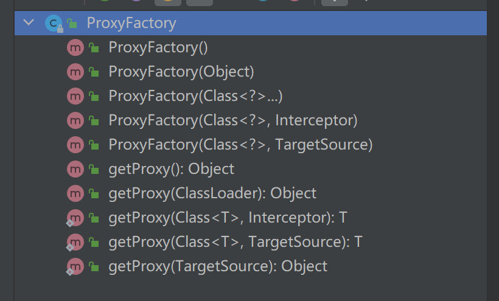
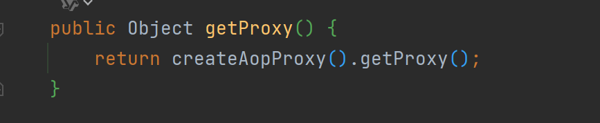
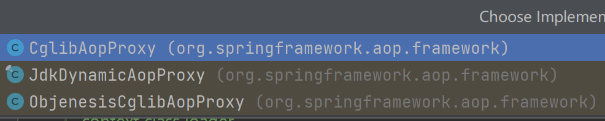
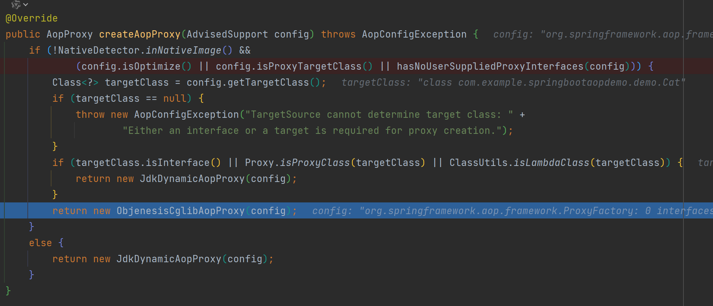
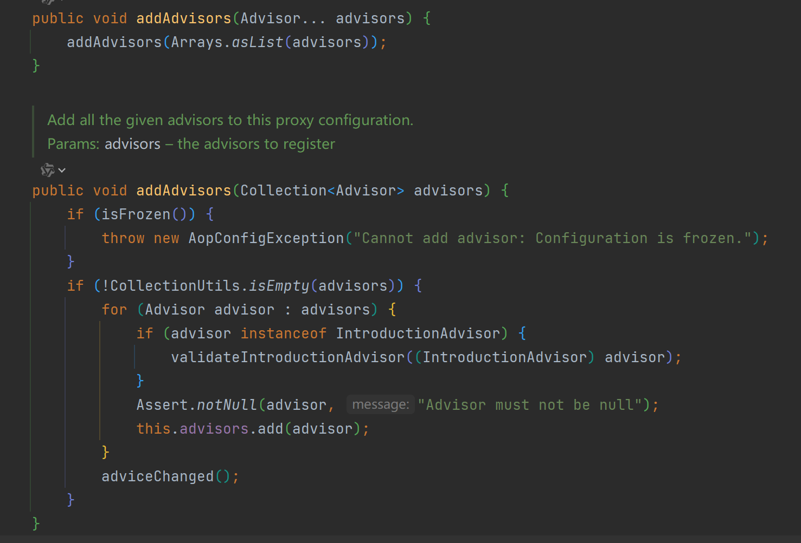

# Spring AOP

## Spring AOP中几个主要接口和类

### PointCut

该接口主要用于 查找匹配 相应的Joinpoint

```java
public interface Pointcut {

   /**
    * Return the ClassFilter for this pointcut.
    * @return the ClassFilter (never {@code null})
    */
   ClassFilter getClassFilter();

   /**
    * Return the MethodMatcher for this pointcut.
    * @return the MethodMatcher (never {@code null})
    */
   MethodMatcher getMethodMatcher();


   /**
    * Canonical Pointcut instance that always matches.
    */
   Pointcut TRUE = TruePointcut.INSTANCE;

}
```

主要几个实现类**JdkRegexpMethodPointcut**、**NameMatchMethodPointcut**、**AnnotationMatchingPointcut**

JdkRegexpMethodPointcut 通过正则表达式对方法名进行匹配

NameMatchMethodPointcut 通过匹配方法名进行匹配。

AnnotationMatchingPointcut 通过匹对是否存在指定类型的注解进行匹配

### Advice

像MethodBeforeAdvice、AfterReturningAdvice、ThrowsAdvice

会发现并没有Around类型的Advice，因为Around是通过MethodInterceptor接口实现的，如：org.springframework.aop.aspectj.AspectJAroundAdvice

在通过源码调试后，其实代理对象中执行Advice，都是通过对应的MethodInterceptor接口的实现类执行invoke方法，只是before这类的通知，是将Advice组合在MethodInterceptor类中

### Advisor

通知器，定义在哪些Pointcut上执行Advice

```java
public class DefaultPointcutAdvisor extends AbstractGenericPointcutAdvisor implements Serializable {

   private Pointcut pointcut = Pointcut.TRUE;


   /**
    * Create an empty DefaultPointcutAdvisor.
    * <p>Advice must be set before using setter methods.
    * Pointcut will normally be set also, but defaults to {@code Pointcut.TRUE}.
    */
   public DefaultPointcutAdvisor() {
   }

   /**
    * Create a DefaultPointcutAdvisor that matches all methods.
    * <p>{@code Pointcut.TRUE} will be used as Pointcut.
    * @param advice the Advice to use
    */
   public DefaultPointcutAdvisor(Advice advice) {
      this(Pointcut.TRUE, advice);
   }

   /**
    * Create a DefaultPointcutAdvisor, specifying Pointcut and Advice.
    * @param pointcut the Pointcut targeting the Advice
    * @param advice the Advice to run when Pointcut matches
    */
   public DefaultPointcutAdvisor(Pointcut pointcut, Advice advice) {
      this.pointcut = pointcut;
      setAdvice(advice);
   }


   /**
    * Specify the pointcut targeting the advice.
    * <p>Default is {@code Pointcut.TRUE}.
    * @see #setAdvice
    */
   public void setPointcut(@Nullable Pointcut pointcut) {
      this.pointcut = (pointcut != null ? pointcut : Pointcut.TRUE);
   }

   @Override
   public Pointcut getPointcut() {
      return this.pointcut;
   }


   @Override
   public String toString() {
      return getClass().getName() + ": pointcut [" + getPointcut() + "]; advice [" + getAdvice() + "]";
   }

}
```

### 织入器

Advisor类有了，那如何将切面织入目标对象生成对应的代理对象呢

Spring提供了org.springframework.aop.framework.ProxyFactory类


该类的主要方法

通过构造器可以传入目标对象

getProxy()获取最终的AOP代理对象



看看getProxy()做了什么：



通过其父类org.springframework.aop.framework.ProxyCreatorSupport的createAopProxy()方法获取**AopProxy**接口类的实现类，再通过AopProxy的getProxy()方法获取目标的Aop代理类。

AopProxy的实现类有

所以说SpringAOP通过Cglib和Jdk两种动态代理方式实现

通过探寻createAopProxy()方法可以发现最终调用org.springframework.aop.framework.DefaultAopProxyFactory的createAopProxy()方法

可以看到不同情况会使用不同的动态代理方法



获取到对应的AopProxy后，调用getProxy()方法获取代理对象，这里拿**JdkDynamicAopProxy**类的展示

Proxy.newProxyInstance(),JDK动态代理创建

并且精简


从ProxyFactory的方法中似乎没有将Advisor织入的方法，其实是其父类的父类org.springframework.aop.framework.AdvisedSupport提供的



