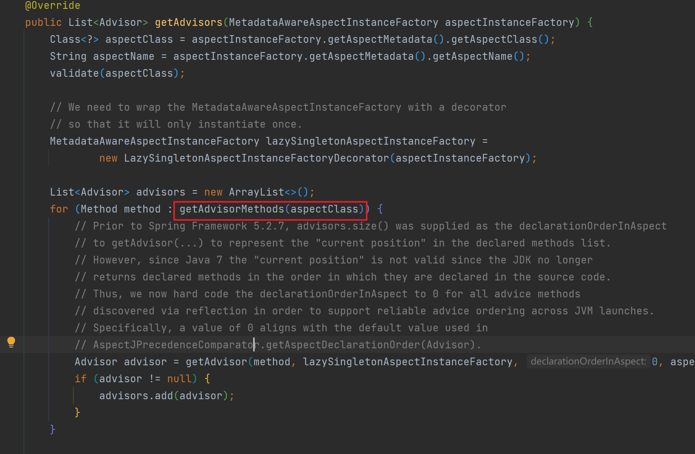

# Spring AOP

## Spring AOP中几个主要接口和类

### PointCut

AOP切点在Spring中的对象

主要用于 查找匹配 相应的Joinpoint，匹配又分ClassFilter匹配对象和MethodMatcher匹配方法

```java
public interface Pointcut {

   /**
    * Return the ClassFilter for this pointcut.
    * @return the ClassFilter (never {@code null})
    */
   ClassFilter getClassFilter();

   /**
    * Return the MethodMatcher for this pointcut.
    * @return the MethodMatcher (never {@code null})
    */
   MethodMatcher getMethodMatcher();


   /**
    * Canonical Pointcut instance that always matches.
    */
   Pointcut TRUE = TruePointcut.INSTANCE;

}
```

常见的几个实现类**JdkRegexpMethodPointcut**、**NameMatchMethodPointcut**、**AnnotationMatchingPointcut**

JdkRegexpMethodPointcut 通过正则表达式对方法名进行匹配

NameMatchMethodPointcut 通过匹配方法名进行匹配。

AnnotationMatchingPointcut 通过匹对是否存在指定类型的注解进行匹配

MethodMatcher分为静态匹配和动态匹配，以上属于静态匹配，目标方法第一次执行以后都不需要再次做匹配，会有缓存；动态匹配主是参数的匹配，每次执行都需要做匹配操作


### Advice

AOP通知在Spring中的对象

像MethodBeforeAdvice、AfterReturningAdvice、AspectJAfterAdvice、ThrowsAdvice、AspectJAroundAdvice

一般的Advice，在Aop代理对象执行方法时，都会通过适配器模式转换为对应的MethodInterceptor类

而Around的类型直接实现的MethodInterceptor类

### Advisor

AOP切面在Spring中的对象

通知器，定义在哪个Pointcut上执行哪个Advice

```java
public class DefaultPointcutAdvisor extends AbstractGenericPointcutAdvisor implements Serializable {

   private Pointcut pointcut = Pointcut.TRUE;


   /**
    * Create an empty DefaultPointcutAdvisor.
    * <p>Advice must be set before using setter methods.
    * Pointcut will normally be set also, but defaults to {@code Pointcut.TRUE}.
    */
   public DefaultPointcutAdvisor() {
   }

   /**
    * Create a DefaultPointcutAdvisor that matches all methods.
    * <p>{@code Pointcut.TRUE} will be used as Pointcut.
    * @param advice the Advice to use
    */
   public DefaultPointcutAdvisor(Advice advice) {
      this(Pointcut.TRUE, advice);
   }

   /**
    * Create a DefaultPointcutAdvisor, specifying Pointcut and Advice.
    * @param pointcut the Pointcut targeting the Advice
    * @param advice the Advice to run when Pointcut matches
    */
   public DefaultPointcutAdvisor(Pointcut pointcut, Advice advice) {
      this.pointcut = pointcut;
      setAdvice(advice);
   }


   /**
    * Specify the pointcut targeting the advice.
    * <p>Default is {@code Pointcut.TRUE}.
    * @see #setAdvice
    */
   public void setPointcut(@Nullable Pointcut pointcut) {
      this.pointcut = (pointcut != null ? pointcut : Pointcut.TRUE);
   }

   @Override
   public Pointcut getPointcut() {
      return this.pointcut;
   }


   @Override
   public String toString() {
      return getClass().getName() + ": pointcut [" + getPointcut() + "]; advice [" + getAdvice() + "]";
   }

}
```

### 织入器

Advisor类有了，那如何将切面织入目标对象生成对应的代理对象呢

Spring提供了org.springframework.aop.framework.ProxyFactory类


该类的主要方法

通过构造器可以传入目标对象

getProxy()获取最终的AOP代理对象


看看getProxy()做了什么：


通过其父类org.springframework.aop.framework.ProxyCreatorSupport的createAopProxy()方法获取**AopProxy**接口类的实现类，再通过AopProxy的getProxy()方法获取目标的Aop代理类。

AopProxy的实现类有

所以说SpringAOP通过Cglib和Jdk两种动态代理方式实现

通过探寻createAopProxy()方法可以发现最终调用org.springframework.aop.framework.DefaultAopProxyFactory的createAopProxy()方法

可以看到不同情况会使用不同的动态代理方法


获取到对应的AopProxy后，调用getProxy()方法获取代理对象，这里拿**JdkDynamicAopProxy**类的展示

Proxy.newProxyInstance(),JDK动态代理创建


从ProxyFactory的方法中似乎没有将Advisor织入的方法，其实是其父类的父类org.springframework.aop.framework.AdvisedSupport提供的

并且JdkDynamicAopProxy和CglibAopProxy也会持有AdvisedSupport类属性，用于获取Advisor、Advice等内容


## AOP代理执行过程

通过上述内容，明白AOP的代理生成是由Jdk或Cglib代理实现，那AOP代理对象执行方法时，又是如何根据切面来增强原方法的呢？

### JdkDynamicAopProxy的invoke()

大家都知道，Jdk动态代理中，代理增强的方法是由

`Proxy.newProxyInstance(ClassLoader loader,Class<?>[] interfaces,InvocationHandler h)`方法中的第三个参数InvocationHandler的invoke方法实现的

上一节中，**JdkDynamicAopProxy**使用Jdk动态代理实现Aop代理时，将**this**作为第三个参数传入，JdkDynamicAopProxy也确实实现了InvocationHandler接口


因此AOP代理对各通知的调用在**JdkDynamicAopProxy**的`invoke()`方法中实现，方法中的关键部分


### 获取拦截器链

使用持有的AdvisedSupport，获取目标方法的拦截器链

拦截器链是通过AdvisedSupport中持有的Advisors，获取Pointcut进行方法的匹配，使用**适配器模式**生成MethodInterceptor(如果是动态匹配，会将MethodInterceptor和MethodMatcher封装为**InterceptorAndDynamicMethodMatcher**对象)，最后组成的集合

由AdvisedSupport持有的advisorChainFactory属性(org.springframework.aop.framework.DefaultAdvisorChainFactory)调用getInterceptorsAndDynamicInterceptionAdvice()方法完成：

```java
@Override
public List<Object> getInterceptorsAndDynamicInterceptionAdvice(
    Advised config, Method method, @Nullable Class<?> targetClass) {

    // This is somewhat tricky... We have to process introductions first,
    // but we need to preserve order in the ultimate list.
    AdvisorAdapterRegistry registry = GlobalAdvisorAdapterRegistry.getInstance();
    // 从AdvisedSupport中获取所有Advisor通知器
    Advisor[] advisors = config.getAdvisors();
    List<Object> interceptorList = new ArrayList<>(advisors.length);
    Class<?> actualClass = (targetClass != null ? targetClass : method.getDeclaringClass());
    Boolean hasIntroductions = null;

    //遍历通知器，根据Advisor持有的Pointcut 进行方法匹配
    for (Advisor advisor : advisors) {
        if (advisor instanceof PointcutAdvisor) {
            // Add it conditionally.
            PointcutAdvisor pointcutAdvisor = (PointcutAdvisor) advisor;
            if (config.isPreFiltered() || pointcutAdvisor.getPointcut().getClassFilter().matches(actualClass)) {
                MethodMatcher mm = pointcutAdvisor.getPointcut().getMethodMatcher();
                boolean match;
                //方法匹配
                if (mm instanceof IntroductionAwareMethodMatcher) {
                    if (hasIntroductions == null) {
                        hasIntroductions = hasMatchingIntroductions(advisors, actualClass);
                    }
                    match = ((IntroductionAwareMethodMatcher) mm).matches(method, actualClass, hasIntroductions);
                }
                else {
                    match = mm.matches(method, actualClass);
                }
                if (match) {
                    //匹配成功，通过适配器将advisor中的Advice转换为MethodInterceptor
                    MethodInterceptor[] interceptors = registry.getInterceptors(advisor);
                    //根据是否是运行时匹配，如果是，则创建一个InterceptorAndDynamicMethodMatcher对象
					//运行时匹配主要指，需要通过参数匹配的情况
                    if (mm.isRuntime()) {
                        // Creating a new object instance in the getInterceptors() method
                        // isn't a problem as we normally cache created chains.
                        for (MethodInterceptor interceptor : interceptors) {
                            interceptorList.add(new InterceptorAndDynamicMethodMatcher(interceptor, mm));
                        }
                    }
                    else {
                        interceptorList.addAll(Arrays.asList(interceptors));
                    }
                }
            }
        }
        else if (advisor instanceof IntroductionAdvisor) {
            IntroductionAdvisor ia = (IntroductionAdvisor) advisor;
            if (config.isPreFiltered() || ia.getClassFilter().matches(actualClass)) {
                Interceptor[] interceptors = registry.getInterceptors(advisor);
                interceptorList.addAll(Arrays.asList(interceptors));
            }
        }
        else {
            Interceptor[] interceptors = registry.getInterceptors(advisor);
            interceptorList.addAll(Arrays.asList(interceptors));
        }
    }

    return interceptorList;
}
```

### 拦截器链调用

如果目标方法存在通知，就能获取相应的拦截器链，拦截器链的调用由**ReflectiveMethodInvocation**的proceed()执行

ReflectiveMethodInvocation 通过构造器持有代理对象，目标对象，方法对象，方法参数，和拦截器集合

```java
protected ReflectiveMethodInvocation(
      Object proxy, @Nullable Object target, Method method, @Nullable Object[] arguments,
      @Nullable Class<?> targetClass, List<Object> interceptorsAndDynamicMethodMatchers) {

   this.proxy = proxy;
   this.target = target;
   this.targetClass = targetClass;
   this.method = BridgeMethodResolver.findBridgedMethod(method);
   this.arguments = AopProxyUtils.adaptArgumentsIfNecessary(method, arguments);
   this.interceptorsAndDynamicMethodMatchers = interceptorsAndDynamicMethodMatchers;
}
```

通过递归调用proceed()，遍历调用拦截器链，看一下proceed()方法

最后都是调用拦截器的invoke方法，参数传入ReflectiveMethodInvocation对象自身，在拦截器中再调用proceed()来进行拦截器链的遍历调用

```java
public Object proceed() throws Throwable {
	// We start with an index of -1 and increment early.
	if (this.currentInterceptorIndex == this.interceptorsAndDynamicMethodMatchers.size() - 1) {
		//当拦截器链全部调用完毕，调用目标方法，内部也是使用 AopUtils.invokeJoinpointUsingReflection()完成
		return invokeJoinpoint();
	}
	//获取下一个拦截器
	Object interceptorOrInterceptionAdvice =
			this.interceptorsAndDynamicMethodMatchers.get(++this.currentInterceptorIndex);
	//判断是否为动态匹配
	if (interceptorOrInterceptionAdvice instanceof InterceptorAndDynamicMethodMatcher) {
		// 是动态匹配
		// Evaluate dynamic method matcher here: static part will already have
		// been evaluated and found to match.
		InterceptorAndDynamicMethodMatcher dm =
				(InterceptorAndDynamicMethodMatcher) interceptorOrInterceptionAdvice;
		Class<?> targetClass = (this.targetClass != null ? this.targetClass : this.method.getDeclaringClass
		if (dm.methodMatcher.matches(this.method, targetClass, this.arguments)) {
			return dm.interceptor.invoke(this);
		}
		else {
			// Dynamic matching failed.
			// Skip this interceptor and invoke the next in the chain.
			return proceed();
		}
	}
	else {
		// 不是动态匹配，直接调用各拦截器的invoke方法
		// It's an interceptor, so we just invoke it: The pointcut will have
		// been evaluated statically before this object was constructed.
		return ((MethodInterceptor) interceptorOrInterceptionAdvice).invoke(this);
	}
}
```

以下AOP切面示例

```java
@Aspect
@Component
public class A {

    @Before("execution(public void com.example.springbootaopdemo.demo.Cat.eat())")
    public void before() {
        System.out.println("before");
    }

    @Around("execution(public void com.example.springbootaopdemo.demo.Cat.eat())")
    public void around(ProceedingJoinPoint joinPoint) throws Throwable {
        System.out.println("around-before");
        joinPoint.proceed();
        System.out.println("around-after");
    }

    @After("execution(public void com.example.springbootaopdemo.demo.Cat.eat())")
    public void after() {
        System.out.println("after");
    }

}

public interface Animal {
    void eat();
}

@Component("cat")
public class Cat implements Animal{
    @Override
    public void eat(){
        System.out.println("猫吃鱼");
    }
}
```

在ReflectiveMethodInvocation的proceed()执行时，拦截链中的各拦截器


MethodBeforeAdviceInterceptor的invoke()

```java
public Object invoke(MethodInvocation mi) throws Throwable {
   //先调用before类型的advice，再调用mi.proceed()继续调用后续拦截器
   //before 内部使用AbstractAspectJAdvice的模板方法invokeAdviceMethod
   this.advice.before(mi.getMethod(), mi.getArguments(), mi.getThis());
   return mi.proceed();
}
```

AspectJAfterAdvice的inovke()

```java
public Object invoke(MethodInvocation mi) throws Throwable {
    //先继续调用后续拦截器为了最后执行原方法，再执行after方法
    //因为After是无论原方法执行成功与否都需要执行的逻辑，所以使用finally
    try {
        return mi.proceed();
    }
    finally {
        //执行父类AbstractAspectJAdvice的模板方法，来执行after方法
        invokeAdviceMethod(getJoinPointMatch(), null, null);
    }
}
```

AspectJAroundAdvice的invoke()方法

```java
public Object invoke(MethodInvocation mi) throws Throwable {
   if (!(mi instanceof ProxyMethodInvocation)) {
      throw new IllegalStateException("MethodInvocation is not a Spring ProxyMethodInvocation: " + mi);
   }
   ProxyMethodInvocation pmi = (ProxyMethodInvocation) mi;
   ProceedingJoinPoint pjp = lazyGetProceedingJoinPoint(pmi);
   JoinPointMatch jpm = getJoinPointMatch(pmi);
   //调用AbstractAspectJAdvice的invokeAdviceMethod方法
   return invokeAdviceMethod(pjp, jpm, null, null);
}
```

没有显示的调用proceed()，因为对于Around类似的通知，proceed()由ProceedingJoinPoint调用，调用时机交给用户控制

对于用户来说调用proceed()是调用目标原方法，内部其实先去调用剩余的拦截器链才最后调用的目标原方法。

如上述A切面的Around方法

```java
@Around("execution(public void com.example.springbootaopdemo.demo.Cat.eat())")
public void around(ProceedingJoinPoint joinPoint) throws Throwable {
    System.out.println("around-before");
    joinPoint.proceed();
    System.out.println("around-after");
}
```

根据上述例子拦截器链的顺序，执行过程顺序为


## 通知类的排序

### 第一次排序

上一章节看到，Cat类的AOP代理对象在执行相关方法时，通知类构造的拦截器顺序是Around->Before->After，而我们在切面中定义Advice时先按顺序是Before->Around->After，所以Aspect切面中的Advice类生成后，肯定进行了排序。

首先得弄清楚Advice类在何时创建

经过调用栈发现在切面类Bean的AnnotationAwareAspectJAutoProxyCreator后置处理器的postProcessBeforeInstantiation()方法中(实质调用的是AbstractAutoProxyCreator的方法)，最终会调用**BeanFactoryAspectJAdvisorsBuilder**的`buildAspectJAdvisors()`来生成和缓存当前Aspect中的Advisor

> 这里生成的Advisor是InstantiationModelAwarePointcutAdvisorImpl类，创建InstantiationModelAwarePointcutAdvisorImpl对象时，在构造器中也创建了Advice
>
> InstantiationModelAwarePointcutAdvisorImpl类在为目标对象创建代理对象时，会转换为Advisor类型


getAdvisors()方法调用的是**ReflectiveAspectJAdvisorFactory**类实现的方法

debug会发现其中的getAdvisorMethods(aspectClass)语句给出的Method集合就是按照Around->Before->After顺序给出的



看一下getAdvisorMethods()方法，主要到执行了`methods.sort(adviceMethodComparator)`


adviceMethodComparator是一个Comparator，内容在该类静态代码块中复制


所以一个切面内的Advice顺序按照**Around, Before, After, AfterReturning, AfterThrowing**

### 第二次排序

当目标对象在后置处理器中进行AOP代理创建时，会查询所有属于目标对象的通知器类，那不同切面的Advisor如何排序

找到目标对象的AOP代理对象生成的后置处理方法AbstractAutoProxyCreator的postProcessAfterInitialization()其中的wrapIfNecessary()

其中的getAdvicesAndAdvisorsForBean()就是查找目标对象是否有Advisor


进入方法，在其子类**AbstractAdvisorAutoProxyCreator**的findEligibleAdvisors()方法中可以看到`eligibleAdvisors = sortAdvisors(eligibleAdvisors);`


使用的是子类**AspectJAwareAdvisorAutoProxyCreator**的sortAdvisors()

```java
protected List<Advisor> sortAdvisors(List<Advisor> advisors) {
    List<PartiallyComparableAdvisorHolder> partiallyComparableAdvisors = new ArrayList<>(advisors.size());
    for (Advisor advisor : advisors) {
        //构造PartiallyComparableAdvisorHolder 实现了PartialComparable
        // DEFAULT_PRECEDENCE_COMPARATOR 赋值为 AspectJPrecedenceComparator类对象，该对象拥有一个AnnotationAwareOrderComparator(OrderComparator的子类)
        partiallyComparableAdvisors.add(
            new PartiallyComparableAdvisorHolder(advisor, DEFAULT_PRECEDENCE_COMPARATOR));
    }
    //进行偏序排序
    List<PartiallyComparableAdvisorHolder> sorted = PartialOrder.sort(partiallyComparableAdvisors);
    if (sorted != null) {
        List<Advisor> result = new ArrayList<>(advisors.size());
        for (PartiallyComparableAdvisorHolder pcAdvisor : sorted) {
            result.add(pcAdvisor.getAdvisor());
        }
        return result;
    }
    else {
        //偏序排序的结构为空时，使用父类的sortAdvisors，内部就是AnnotationAwareOrderComparator.sort(advisors)
        return super.sortAdvisors(advisors);
    }
}
```

偏序排序没有深入研究，但是在PartialOrder.sort()方中还是调用了**DEFAULT_PRECEDENCE_COMPARATOR**(AspectJPrecedenceComparator)的compareTo方法，**AspectJPrecedenceComparator**类的compareTo实际使用的**AnnotationAwareOrderComparator**的compareTo，AnnotationAwareOrderComparator并没重写compareTo，使用的OrderComparator的方法，也就是按照Advisor的Order进行排序的

那Advisor的Order哪来的。

在第一次排序中我们说到Advisor在切面Bean初始化时创建，并且创建的实际上是InstantiationModelAwarePointcutAdvisorImpl类，其是间接实现了Ordered接口的


InstantiationModelAwarePointcutAdvisorImpl的getOrder()方法最终是调用BeanFactoryAspectInstanceFactory的getOrder()

其中的name就是切面类bean的name

```java
@Override
public int getOrder() {
   Class<?> type = this.beanFactory.getType(this.name);
   if (type != null) {
      if (Ordered.class.isAssignableFrom(type) && this.beanFactory.isSingleton(this.name)) {
         return ((Ordered) this.beanFactory.getBean(this.name)).getOrder();
      }
      return OrderUtils.getOrder(type, Ordered.LOWEST_PRECEDENCE);
   }
   return Ordered.LOWEST_PRECEDENCE;
}
```

也就是最终一个AOP代理对象中的拦截器或者说通知器的顺序，是按照切面类的Order来的，如果是同一个切面类中的是按照既定的**Around, Before, After, AfterReturning, AfterThrowing**顺序
