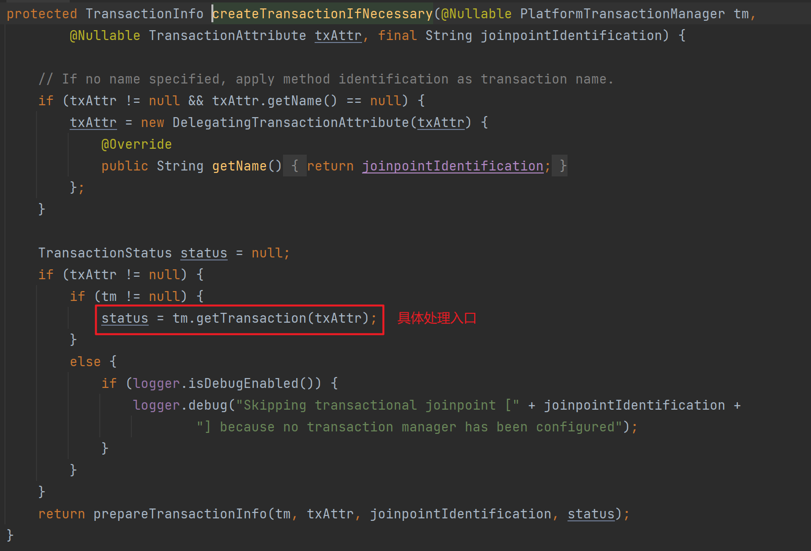
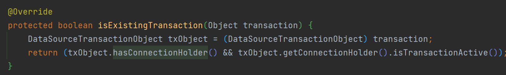
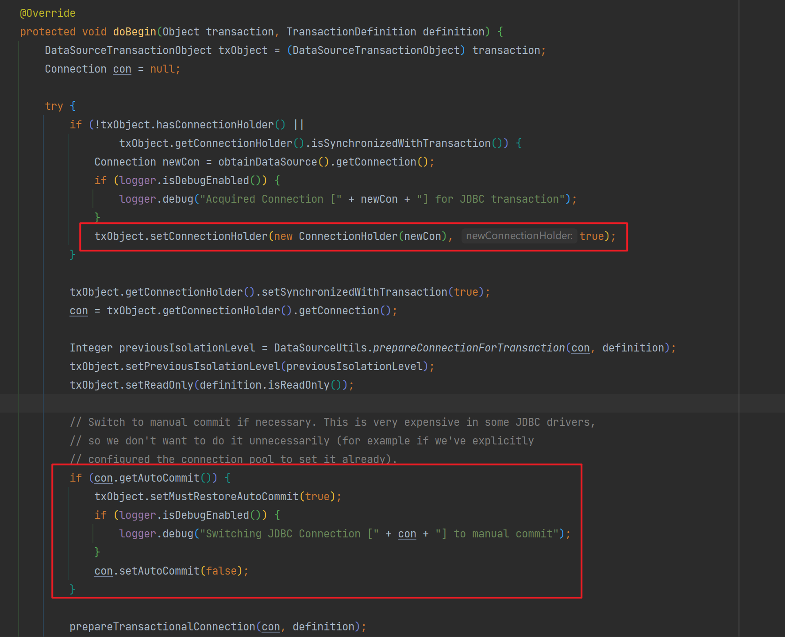
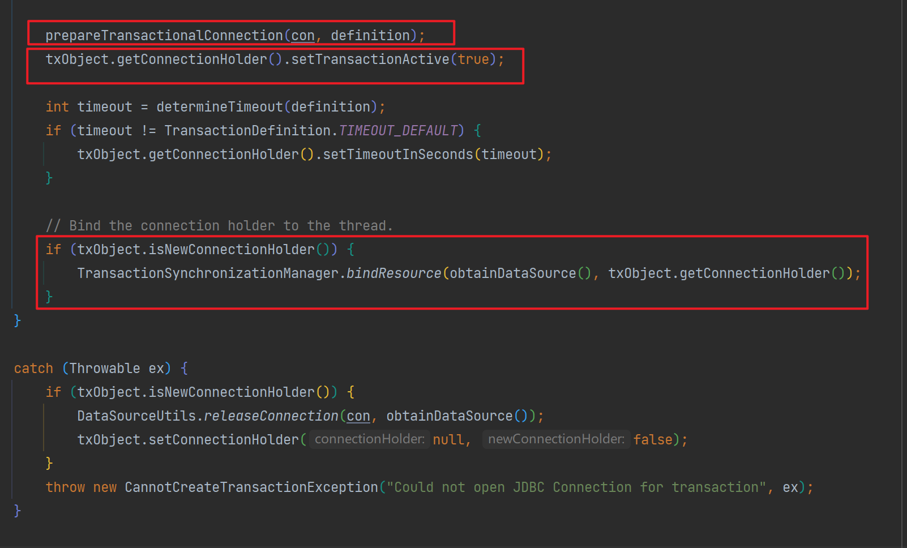
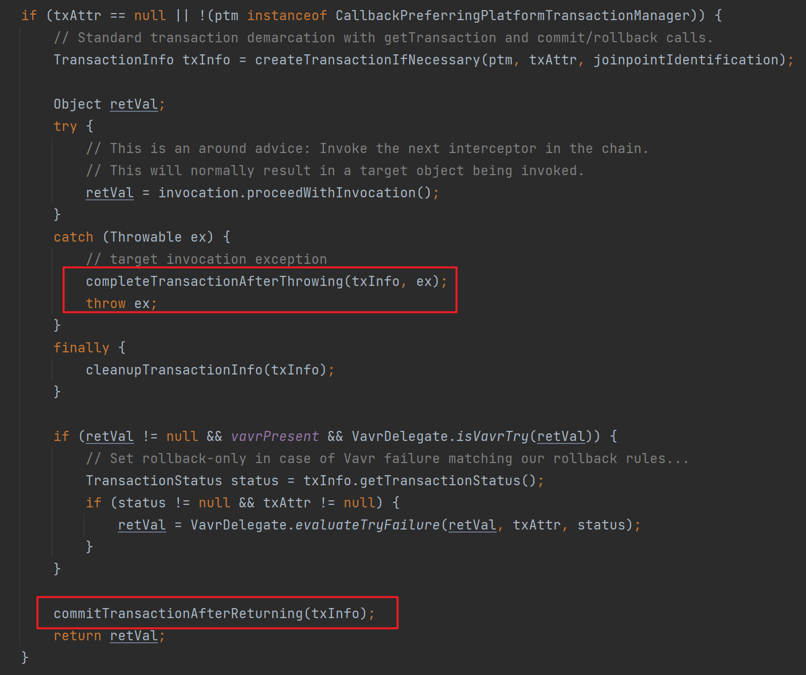
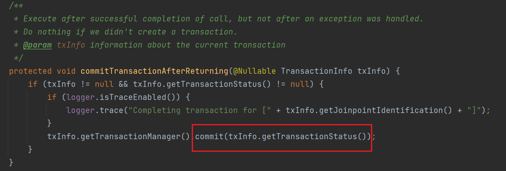
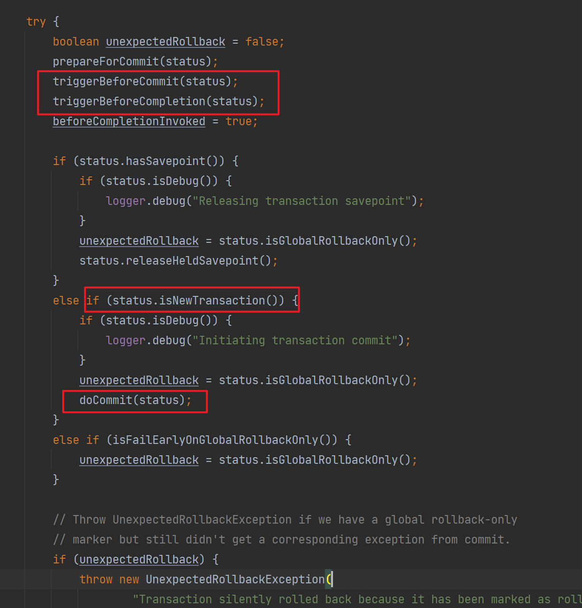
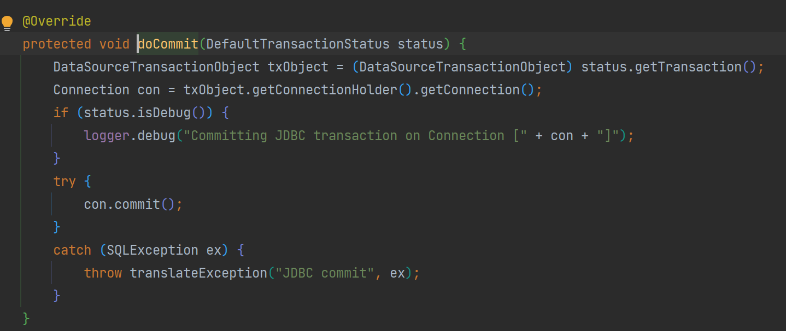
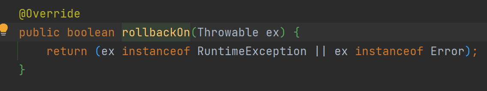
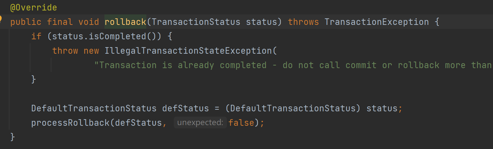

# Spring声明式事务

## 五种失效情况

1. 类没有被 Spring 管理

2. 方法不是public修饰

3. 异常被捕获（事务默认只在抛出运行时异常）

4. 同一个类中，方法内部调用

   方法内部使用this.xxx()的方式调用事务存在事务的方法；
   失效的本质是，this指的的是对象本身，而不是代理对象，事务是由AOP代理来实现的，处理事务的增强方法都是在代理对象的方法中，因此使用this对象本身调用方法AOP会失效。
   为什么this指的是对象本身而不是代理对象呢，原因，代理对象执行方法时，增强方法在代理对象的方法中，而原对象方法还是使用原对象来调用的，由原对象调用的方法中使用this，指向的当然时原对象。
   解决，不用this调用本类中的方法，从容器中获取bean再调用

5. MySQL存储引警不支持事务

参考：[https://blog.csdn.net/qq_52423918/article/details/130806813](https://blog.csdn.net/qq_52423918/article/details/130806813)

## 传播行为

事务协调员（内部方法）对事务管理员（外部方法）是否携带事务而进行的处理态度

1.**`REQUIRED`**

当外部方法存在事务时，内部方法事务将加入外部事务，内部事务产生回滚时，外部事务也回滚
当外部方法不存在事务时，内部方法事务就创建自己的事务

2.**`REQUIRES_NEW`**

当外部方法存在事务时，内部方法创建自己独立的事务，不受外部事务影响
当外部方法不存在事务时，内部方法创建自己独立的事务

3.**`NESTED`**

当外部方法存在事务时，内部方法事务成为外部事务的嵌套子事务，当内部事务回滚时只会回滚到内部事务执行前状态
当外部方法不存在事务时，内部方法创建自己独立的事务执行

4.**`MANDATORY`**

当外部方法存在事务，内部方法事务加入

当外部方法不存在事务时，抛出异常

5.**`SUPPORTS`**

当外部方法存在事务，内部方法事务加入
当外部方法不存在事务时，内部方法就不使用事务

6.**`NOT_SUPPORTED`**

不管外部方法是否有事务，内部方法的事务都不生效，执行到内部方法时，外部事务挂起等待内部方法执行

7.**`NEVER`**

总是非事务地执行，如果外部方法存在事务，则抛出异常。

## Spring事务源码分析

spring使用AOP实现声明式事务，其中涉及到许多配置和属性读取，如事务管理器、事务传播行为等待；

源码分析之前，需要明确Spring事务帮我们做了什么：

- 从数据池中获取数据库连接
- 开启事务并设置手动提交
- 调用原方法
- 提交/回滚 事务

此处暂时研究spring事务的创建、提交、回滚相关执行流程

案例

```java
public class A {
    @Transactional
    public void a() {
        Dept dept = new Dept();
        dept.setDeptName("测试事务3");
        deptService.save(dept);
        B b = new B();
        b.b();
    }
}

public class B {
    @Transactional
    public void b() {
        User user = new User();
        user.setUserName("测试事务");
		user.setNickName("测试事务");
		user.setPassword("测试事务");
		userService.save(user);
    }
}
```

👇当执行 a()方法时，AOP代理中会调用TransactionInterceptor类中的invoke方法，核心在其父类的invokeWithinTransaction方法中，包含了整个事务处理的过程


👇来看一下事务开启做了什么，createTransactionIfNecessary



开启事务的具体处理由事务管理器的抽象类(AbstractPlatformTransactionManager)定义，使用getTransaction模板方法，传入事务属性


doGetTransaction 返回一个事务对象 由具体的事务管理器实现类实现 一般为DataSourceTransactionManager


从事务同步管理器中获取数据库连接资源，该资源是通过ThreadLocal与线程绑定的，TransactionSynchronizationManager保存着当前线程事务中的事务资源和一些事务信息(如当前事务的名称、事务隔离级别等)，第一次执行时，TransactionSynchronizationManager中并不存在资源，ConnectionHolder为null

创建一个事务对象存放当前事务的数据连接持有对象 和 是否为新持有对象的标识，后续通过该数据持有对象获取连接。

回到`getTransaction`继续执行，`isExistingTransaction`判断当前是否已存在事务，分支内是对于子事务如何处理的入口

DataSourceTransactionManager 的 isExistingTransaction




通过查看事务对象是否存在数据连接持有对象 数据连接是否存在活动事务标志，来判断是否已存在事务；声明式事务方法第一次执行时，条件显然不成立；

继续执行


通过对事务属性中的事务传播行为判断，三个常用的传播行为，调用startTransaction 开启事务


该方法会创建一个事务状态对象，保存着当前事务的属性，事务对象，是否为新事物等等信息，用于后续事务处理的；

继续执行到 的 `doBegin`，由事务管理器实现类实现

此处是DataSourceTransactionManager的实现





会从数据池中获取连接，并将连接持有对象存入到事务对象中，设置新持有对象状态为true，然后将连接设为事务手动提交；连接持有对象活动事务标志设上，保证前面判断已存在事务的正确性；由于是新持有对象，可执行TransactionSynchronizationManager的绑定操作，这就保证了，子事务在开启的过程中doGetTransaction()方法中能够获取同一持有对象。

回到startTransaction，继续执行prepareSynchronization方法，将当前事务的状态(如：当前事务开启状态、激活状态、隔离级别)、初始化事务同步回调内容，存放的是当前需要操作的事务信息。


至此开启事务结束，返回事务状态对象，回到`invokeWithinTransaction`执行带代理的原方法


如果当前方法中没有调用其他存在事务的方法，那么原方法调用完成后，直接回滚或者提交

先看看提交










提交由事务管理器抽象类提供模板方法，其中triggerBeforeCommit(status)和triggerBeforeCompletion(status);方法是通过获取TransactionSynchronizationManager中配置的事务提交前执行方法，进行事务提交前的前置操作，用户可以根据情况在TransactionSynchronizationManager中注册事务前置和后置方法。

事务管理器的提交方法其实就是获取存储的事务连接对象，手动commit。


可以看到，提交一定要是事务状态为新事务时，才能提交；

回到案例，当原方法执行时，又执行了一个声明式事务方法b.b();

此时重新开始执行上面分析的事务开启方法，在isExistingTransaction处，因为第一个事务开启时将连接持有对象与线程绑定由TransactionSynchronizationManager管理，此处判断为true,执行另一创建事务状态对象的逻辑handleExistingTransaction


可以看到，当判断已存在事务时，会根据事务传播行为，来执行不同的逻辑，案例的子事务传播行为是默认的PROPAGATION_REQUIRED走最后一个创建事务状态过程，可以看到`newTransaction`，设置为了false

所以当子事务方法，执行到提交操作时，并不会走提交，父事务执行提交时才会真正提交。

来看看回滚


原方法抛出异常时，进入处理（当原方法捕获了异常但是不抛出新异常，就会事务失效）




会判断当前异常是否是定义的异常，如果注解没有定义回滚异常，就使用父类方法匹对(匹对异常RuntimeException或者Error)

匹对失败直接执行提交的操作，匹对成功执行回滚操作（==此处就是为什么方法中抛出的异常与定义的回滚异常不一致时，事务失效的原因==）




回滚中，对事务状态做了许多判断，在案例的情况下，子事务加入父事务没有开启新事物，status.isNewTransaction()为false,就进入分支执行doSetRollbackOnly，为事务的连接持有对象设置了一个回滚标记


所以如果加入父事务的子事务抛出了异常，此时不管父事务的原方法是捕获了异常，还是正常抛出，事务都会回滚

如果父事务真正抛出异常，那事务状态中isNewTransaction为true，直接回滚

如果父事务将子事务的异常捕获且没有抛出新异常，那父事务其实会正常进入提交的操作但是最后还是会回滚，那为什么异常被捕获事务没有失效，我们回看提交模板方法中

在processCommit前其实还有判断

defStatus.isGlobalRollbackOnly() 其实就是判断，当前连接持有对象中的回滚标记是否为true，子事务中将其置为true，因此，最后还是进行了回滚


## 多线程下事务的处理

通过源码分析，spring处理事务的方式本质就是帮我们获取数据库连接，调用数据库连接的手动提交和回滚；而获取的数据库连接资源绑定在线程中由TransactionSynchronizationManager帮忙管理，事务其实就是同一连接中的数据库操作的一致性；多线程下spring声明式事务的失效原因是线程之间的数据隔离，也就是多线程下获取的数据库连接都不一致了，就谈不上事务了。

我们使用Mybatis时，mybatis在执行sql前会从TransactionSynchronizationManager中取获取数据库连接


所以可以在子线程调用开启事务的方法之前，将主线程中获取到的数据库连接资源绑定到子线程上，并将子线程的异常正常抛出，保证正常回滚

例：

```java
@Transactional
public void test() {
    ConnectionHolder resource = (ConnectionHolder) TransactionSynchronizationManager.getResource(dataSource);
    System.out.println(Thread.currentThread());
    System.out.println(TransactionSynchronizationManager.getCurrentTransactionName());
    //子线程1
    CompletableFuture<Boolean> future1 = CompletableFuture.supplyAsync(() -> {
        System.out.println(Thread.currentThread());

        TransactionSynchronizationManager.bindResource(dataSource, resource);
        Dept dept = new Dept();
        dept.setDeptName("测试事务");
        return deptService.save(dept);
    }).whenComplete((result, ex) -> {
        TransactionSynchronizationManager.unbindResource(dataSource);
    });
    //子线程2
    CompletableFuture<Boolean> future2 = CompletableFuture.supplyAsync(() -> {
        System.out.println(Thread.currentThread());
        TransactionSynchronizationManager.bindResource(dataSource, resource);
        mutiplyThreadTranscationManager.test();//开启默认事务传播行为
        return true;
    }).whenComplete((result, ex) -> {
        TransactionSynchronizationManager.unbindResource(dataSource);
    });

    CompletableFuture.allOf(future1, future2).join();
    List<Supplier> tasks = new ArrayList<>();

    Dept dept1 = new Dept();
    dept1.setDeptName("测试事务3");
    deptService.save(dept1);
    int a = 1 / 0;
}

//MutiplyThreadTranscationManager
@Transactional
public void test(){
    User user = new User();
    user.setUserName("测试事务");
    user.setNickName("测试事务");
    user.setPassword("测试事务");
    userService.save(user);
}
```
