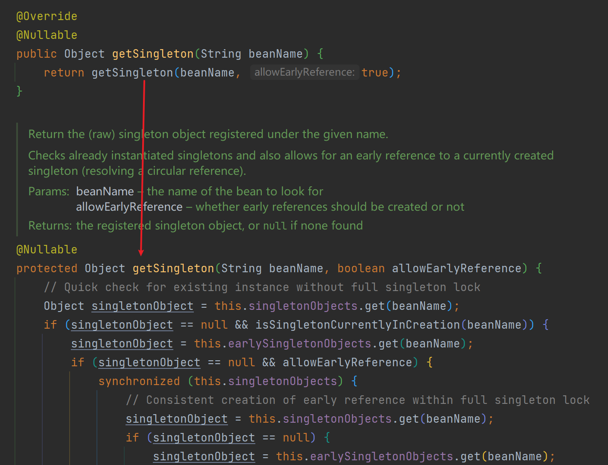
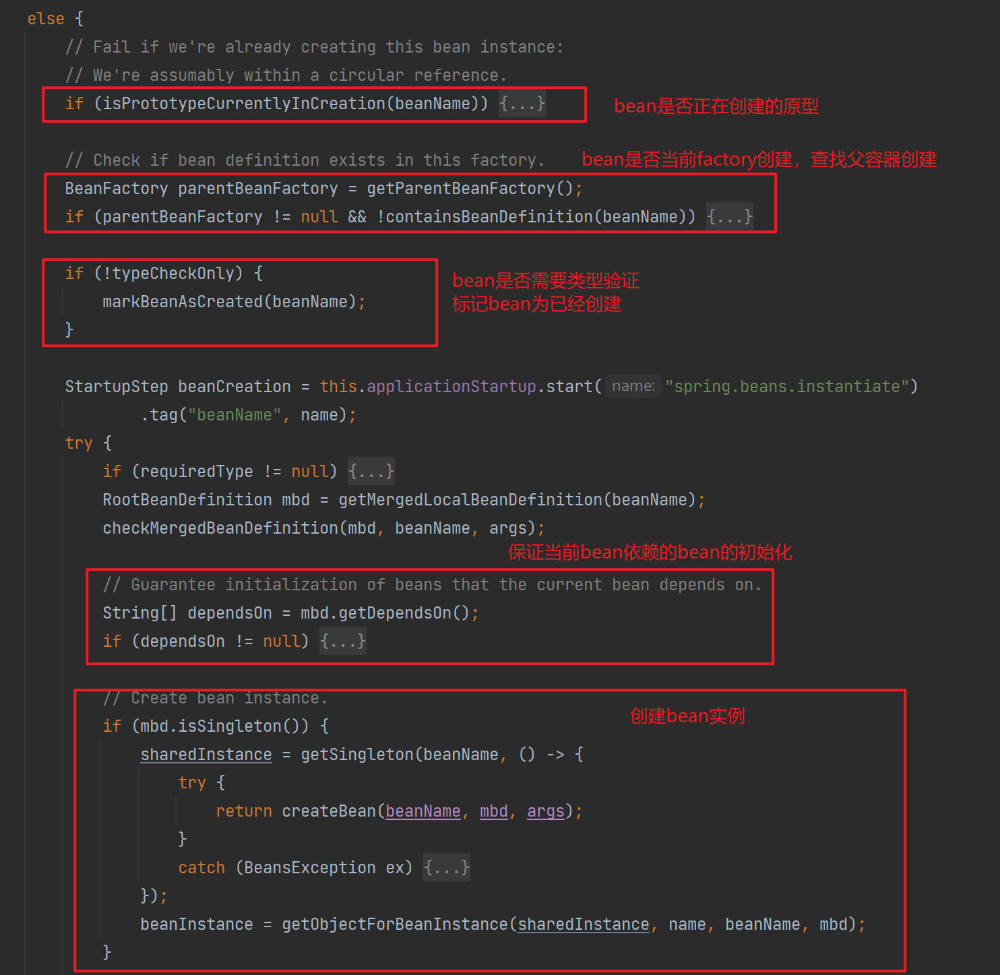

# 循环依赖

类A依赖类B，类B也依赖类A，这种情况就会出现循环依赖。 Bean A → Bean B → Bean A

循环依赖会导致`内存溢出`

```java
public class AService {
private BService bService = new BService();
}

public class BService {
private AService aService = new AService();
}
```

当通过 new AService() 创建一个对象时你会获得一个栈溢出的错误
因为调用 new AService() 时会先去执行属性 bService 的初始化, 而 bService 的初始化又会去执行AService 的初始化， 这样就形成了一个循环调用，最终导致调用栈内存溢出。

> 注意：从springboot2.6.0开始，默认关闭循环依赖，如果需要开启，添加配置`spring.main.allow-circular-references=true`
>
> 

## 解决循环依赖的简单思路

```java
// 模拟spring解决循环依赖的缓存 key存类名 value存bean实例，防止循环依赖后不断创建新对象导致栈内存溢出
private static Map<String, Object> cacheMap = new HashMap<>();

public static void main(String[] args) throws InvocationTargetException, NoSuchMethodException, InstantiationException, IllegalAccessException {
    Class[] classes = {Dept.class, Stuff.class};
    for (Class classA : classes) {
        //获取bean
        getBean(classA);
    }

    System.out.println(getBean(Stuff.class).getDept() == getBean(Dept.class));
    System.out.println(getBean(Dept.class).getStuff() == getBean(Stuff.class));

}

public static <T> T getBean(Class<T> bean) throws NoSuchMethodException, InvocationTargetException, InstantiationException, IllegalAccessException {
    // 获取要创建的bean的类名
    String beanName = bean.getSimpleName().toLowerCase();

    // 判断缓存map的key里面是否有该类名
    if (cacheMap.containsKey(beanName)) {
        //存在直接返回实例bean
        return (T) cacheMap.get(beanName);
    }
    //不存在类名，使用反射得到实例化的bean  obj
    Object obj = bean.getDeclaredConstructor().newInstance();
    //将实例化的bean和类名存入缓存map中
    cacheMap.put(beanName, obj);

    //获取bean里面的属性
    Field[] fields = obj.getClass().getDeclaredFields();


    //设置的是bean里面的属性
    for (Field field : fields) {
        field.setAccessible(true);
        Class<?> fieldType = field.getType();
        //属性的类名
        String fieldName = fieldType.getSimpleName().toLowerCase();
        // 第一参数是表示【这个field是属于哪个对象的】，第二个参数放set的值
        //这里第二个查询在缓存map里查找是否有该属性类名的bean，存在直接取出来set进去，不存在递归调用getBean()创建该类的bean
        field.set(obj, cacheMap.containsKey(fieldName)?cacheMap.get(fieldName): getBean(fieldType));
    }
    //最后返回bean
    return (T) obj;
}
```

## spring是如何解决循环依赖的

众所周知，spring使用三级缓存解决循环依赖问题

1. `singletonObjects`：用于存放完全初始化好的 bean，**从该缓存中取出的 bean 可以直接使用**
2. `earlySingletonObjects`：提前曝光的单例对象的cache，存放原始的 bean 对象（尚未填充属性），如果存在循环依赖 会通过第三级缓存生成早期引用存放在此。
3. `singletonFactories`：存放单例对象工厂对象，用于生成早期引用。

获取缓存bean的实现在`DefaultSingletonBeanRegistry`类的方法<a id="getSingleton1()">`getSingleton()`</a>中

```java
protected Object getSingleton(String beanName, boolean allowEarlyReference) {
   // Quick check for existing instance without full singleton lock
    //先从第一个Map中获取成品Bean
   Object singletonObject = this.singletonObjects.get(beanName);
   if (singletonObject == null && isSingletonCurrentlyInCreation(beanName)) {
      //第一个Map中没有，从第二个Map中获取半成品Map
      singletonObject = this.earlySingletonObjects.get(beanName);
      if (singletonObject == null && allowEarlyReference) {
          //如果半成品也没有，那就需要从第三个Map中获取工厂对象来获取半成品Bean
          //加锁保证单例性
         synchronized (this.singletonObjects) {
            // Consistent creation of early reference within full singleton lock
            singletonObject = this.singletonObjects.get(beanName);
            if (singletonObject == null) {
               singletonObject = this.earlySingletonObjects.get(beanName);
               if (singletonObject == null) {
                  ObjectFactory<?> singletonFactory = this.singletonFactories.get(beanName);
                  if (singletonFactory != null) {
                      //获取工厂对象，调用工厂对象的getObject方法，其中会判断该bean是否需要创建AOP
                     singletonObject = singletonFactory.getObject();
                      //创建好的对象，放进第二个Map
                     this.earlySingletonObjects.put(beanName, singletonObject);
                     //从第三个Map中删除对应工厂对象，保证单例性
                     this.singletonFactories.remove(beanName);
                  }
               }
            }
         }
      }
   }
   return singletonObject;
}
```

该方法还有个重载方法，在本文中将上面的`getSingleton()`称为`getSingleton1()`，将下面的方法称为<a id="getSingleton2()">`getSingleton2()`</a>

```java
public Object getSingleton(String beanName, ObjectFactory<?> singletonFactory) {
    Assert.notNull(beanName, "Bean name must not be null");
    synchronized (this.singletonObjects) {
        Object singletonObject = this.singletonObjects.get(beanName);
        if (singletonObject == null) {
            if (this.singletonsCurrentlyInDestruction) {
                throw new BeanCreationNotAllowedException(beanName,"Singleton bean creation not allowed while singletons of this factory are in destruction " +"(Do not request a bean from a BeanFactory in a destroy method implementation!)");
            }
            if (logger.isDebugEnabled()) {
                logger.debug("Creating shared instance of singleton bean '" + beanName + "'");
            }
            beforeSingletonCreation(beanName);
            boolean newSingleton = false;
            boolean recordSuppressedExceptions = (this.suppressedExceptions == null);
            if (recordSuppressedExceptions) {
                this.suppressedExceptions = new LinkedHashSet<>();
            }
            try {
                singletonObject = singletonFactory.getObject();
                newSingleton = true;
            }
            catch (IllegalStateException ex) {
                // Has the singleton object implicitly appeared in the meantime ->
                // if yes, proceed with it since the exception indicates that state.
                singletonObject = this.singletonObjects.get(beanName);
                if (singletonObject == null) {
                    throw ex;
                }
            }
            catch (BeanCreationException ex) {
                if (recordSuppressedExceptions) {
                    for (Exception suppressedException : this.suppressedExceptions) {
                        ex.addRelatedCause(suppressedException);
                    }
                }
                throw ex;
            }
            finally {
                if (recordSuppressedExceptions) {
                    this.suppressedExceptions = null;
                }
                afterSingletonCreation(beanName);
            }
            if (newSingleton) {
                addSingleton(beanName, singletonObject);
            }
        }
        return singletonObject;
    }
}
```

### doGetBean()

假设A与B循环依赖，从注册A的bean开始；

`AbstractBeanFactory`的getBean()为入口，调用doGetBean()

doGetBean一开始就使用getSingleton()，追进去查看，发现使用的是[getSingleton1()](#getSingleton1())

第二个参数为true，即如果第二层缓存不存在，会查看第三层缓存；




此时A是初次创建，三层缓存中并不存在任何相关对象，返回null

不进入该判断分支，进入else




其中的dependsOn依赖处理，并不是指属性依赖注入的依赖初始化

而是处理使用xml定义bean时定义的depends-on，或者@DependsOn注解的依赖；

dependsOn可以指定bean的创建和销毁顺序，所以需要先保证dependsOn依赖的bean先初始化；此处产生的循环依赖无法解决，会抛出异常；


我们来看一下创建bean部分，使用了[getSingleton2()](#getSingleton2()),lambda传入第二个工厂的getObject()实现方法


具体查看一下，执行了哪些操作


这个创建前校验，往`singletonsCurrentlyInCreation`中添加了当前beanName，此处也是循环依赖检测的一个关键点。


接下去执行lambda内容`createBean()`，根据BeanDefinition执行实例化前处理器的相关处理，然后进入`doCreateBean()`


### doCreateBean()

`AbstractAutowireCapableBeanFactory`类中的`doCreateBean`方法，创建bean的具体实现。

该方法主要三大部分：

Bean的实例化

Bean属性填充

Bean的初始化

- 实例化

  ```java
  // Instantiate the bean.
  BeanWrapper instanceWrapper = null;
  if (mbd.isSingleton()) {
      instanceWrapper = this.factoryBeanInstanceCache.remove(beanName);
  }
  if (instanceWrapper == null) {
      instanceWrapper = createBeanInstance(beanName, mbd, args);
  }
  Object bean = instanceWrapper.getWrappedInstance();
  Class<?> beanType = instanceWrapper.getWrappedClass();
  if (beanType != NullBean.class) {
      mbd.resolvedTargetType = beanType;
  }
  ```

  实例化没有深入研究，最终创建了一个Bean的原始对象，还没有对其中的属性进行填充

  实例化后处理循环依赖的关键点：如果当前bean为单例，处于创建中，并且开启了循环依赖的配置，那么`earlySingletonExposure`为true，就调用`addSingletonFactory`，将工厂对象存进第三级缓存

  springboot 2.6.0后加入的循环依赖的配置，默认关闭，配置在此处影响了三级缓存

  `getEarlyBeanReference()`：生成二级缓存中早期引用的方法，如果bean存在实现了`SmartInstantiationAwareBeanPostProcessor`类的后置处理器，就通过后置处理器的getEarlyBeanReference()方法得到代理后的引用，不然就返回原始引用。(这就是@Async的循环依赖无法解决的关键)；

  this.earlyProxyReferences.put(cacheKey, bean);该语句使得初始化时相同后置处理器不会再次生成产生代理对象。

  ```java
  // Eagerly cache singletons to be able to resolve circular references
  // even when triggered by lifecycle interfaces like BeanFactoryAware.
  boolean earlySingletonExposure = (mbd.isSingleton() && this.allowCircularReferences &&
        isSingletonCurrentlyInCreation(beanName));
  if (earlySingletonExposure) {
     if (logger.isTraceEnabled()) {
        logger.trace("Eagerly caching bean '" + beanName +
              "' to allow for resolving potential circular references");
     }
      //往第三个Map中存入beanName对应的一个ObjectFactory，该工厂对象通过lambda传入一个方法
      //该方法就是用于在循环依赖发生后，创建AOP或者返回原始对象的方法
     addSingletonFactory(beanName, () -> getEarlyBeanReference(beanName, mbd, bean));
  }
  
  //Obtain a reference for early access to the specified bean, typically for the purpose of resolving a circular reference.
  protected Object getEarlyBeanReference(String beanName, RootBeanDefinition mbd, Object bean) {
      Object exposedObject = bean;
      if (!mbd.isSynthetic() && hasInstantiationAwareBeanPostProcessors()) {
          for (SmartInstantiationAwareBeanPostProcessor bp : getBeanPostProcessorCache().smartInstantiationAware) {
              exposedObject = 
          }
      }
      return exposedObject;
  }
  
  
  //主要实现方法
  @Override
  public Object getEarlyBeanReference(Object bean, String beanName) {
      Object cacheKey = getCacheKey(bean.getClass(), beanName);
      this.earlyProxyReferences.put(cacheKey, bean);
      return wrapIfNecessary(bean, beanName, cacheKey);
  }
  ```

- 属性填充

  依赖注入就在这完成，如果循环依赖没有开启，该方法就会异常

  `populateBean`(beanName, mbd, instanceWrapper);

  根据调试查看调用链

  applyPropertyValues() -> resolveValueIfNecessary() -> resolveReference() -> getBean()

  获取bean的需要注入的属性，最终又是调用getBean()去获取需要属性注入的B对象

  初次获取B对象，和上面流程一样，又进入属性填充，发现需要注入A对象，又调用getBean()获取A对象，循环就开始，来看一下第二次获取A有什么不同

  根据[getSingleton1()](#getSingleton1())此时能够从三级缓存中获取工厂对象，从而获取早期引用对象，就进入if分组，最后注入B对象中属性中，B对象注入A对象属性中

  

  如果没有打开循环依赖配置，此处依旧获取null，和初次创建A对象一样就会走else分支，执行[getSingleton2()](#getSingleton2())，再执行其中的`beforeSingletonCreation()`方法时，应为`singletonsCurrentlyInCreation`集合已经存在A对象的beanName而添加失败，抛出异常。

  

- 初始化

  属性填充成功后，会进行初始化，在`AbstractAutowireCapableBeanFactory`类中的`initializeBean(String beanName, Object bean,RootBeanDefinition mbd)`方法中

  进行bean的后置处理器处理，如代理对象的创建

  

  但是此处不会生成获取早期引用方法(getEarlyBeanReference())得到的代理对象，因为相关后置处理器的后置处理方法中，会去获取缓存中是否已经有记录，this.earlyProxyReferences.remove(cacheKey)，不存在时才会创建代理对象，不然返回原始对象。

  

- 校验

  

  初始化后，如果允许早期暴露单例(`earlySingletonExposure`为true)，并且能够从一二级缓存中获取早期引用(getSingleton(beanName, false)第二参数为false，只会从第二)，会比较初始化后的对象和原始对象引用是否一致，如果一致，最终使用三级缓存中获得的引用，保证了循环依赖中注入的引用和bean创建好后的引用一致；

## 为什么一级缓存不行

假设只有的第一层Map，存放刚实例化后的Bean，引用不变的情况下，能给解决简单对象的循环依赖问题；

为什么不使用一级缓存

Spring Bean的创建过程主要分为三部分：

1. 创建实例 createBeanInstance
2. 填充依赖属性 populateBean
3. 初始化bean initializeBean

如果只有一级缓存，什么阶段存放，放在初始化后就无法解决循环依赖；放在实例化后无法解决代理对象的循环依赖问题

所以在Spring框架下，想使用一级缓存解决循环依赖不合理，至少需要二级缓存

## 为什么二级缓存不够

如果二级缓存直接存储ObjectFactory对象，用于提前暴露代理引用，那么如果A对象依赖B和C，而B和C又依赖A的情况下

B、C中注入的A会是两个对象，因为B注入A时使用的二级缓存ObjectFactory对象创建A，C注入A时也是使用的二级缓存ObjectFactory对象创建A，创建的都是新对象；

我的理解就是，第三个Map即解决存在AOP情况下的循环依赖问题，又保证第二个Map中存放的始终是半成品Bean，层次分；

## spring无法解决的循环依赖

### 构造器注入的循环依赖无法解决

spring处理循环依赖都是在实例化之后，但是构造器的注入是发生在实例化期间，在此期间三个map中都不会存在可获取的Bean，无法应用spring的三层缓存

### 使用@Async

参考：[https://www.yisu.com/jc/724480.html](https://www.yisu.com/jc/724480.html)

因为使用@Async的类的代理对象生成和AOP代理对象生成使用的是不同的类的方法，

一般的AOP动态代理是依靠 `AnnotationAwareAspectJAutoProxyCreator` 获取的

而@Async的代理是通过`AsyncAnnotationBeanPostProcessor` 获取的

我们知道在spring的第三层缓存中放着ObjectFactory对象，用于获取对象的早期引用，如果对象需要代理就可以通过`getEarlyBeanReference`方法获取

但是`getEarlyBeanReference`方法中，只会通过`SmartInstantiationAwareBeanPostProcessor`类的实现类的后置处理器来获取代理对象，而`AsyncAnnotationBeanPostProcessor`并不没有实现`SmartInstantiationAwareBeanPostProcessor`，因此在此处@Async的类获取到的早期引用是原始对象，当进入到第三阶段初始化时才会通过`AsyncAnnotationBeanPostProcessor`获取代理对象，


`doCreateBean`创建bean流程中，初始化后，会比较初始化后的对象与原始对象是否为同一引用

而普通AOP代理在循环依赖的情况下，初始化阶段时不会获取代理对象的，因为在二级缓存中已经存在代理对象的引用，而使用@Async的代理对象是在初始化阶段得到的，那么`exposedObject == bean`就为fasle，随后进入检查当前bean是否依赖其他bean，存在依赖其他bean抛异常`BeanCurrentlyInCreationException`


