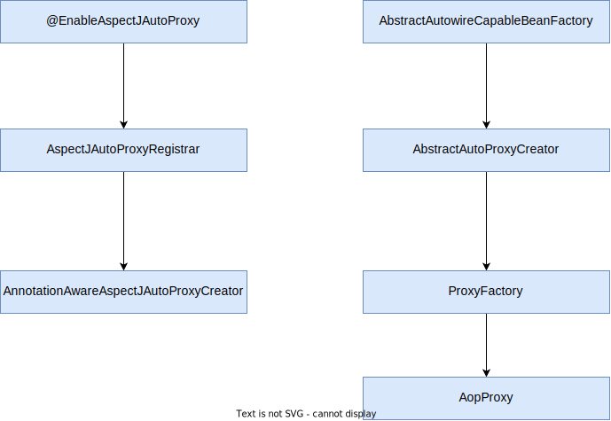
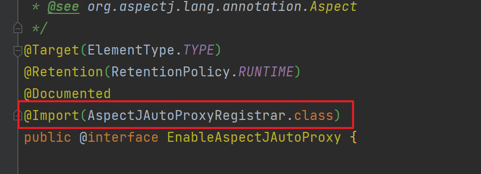
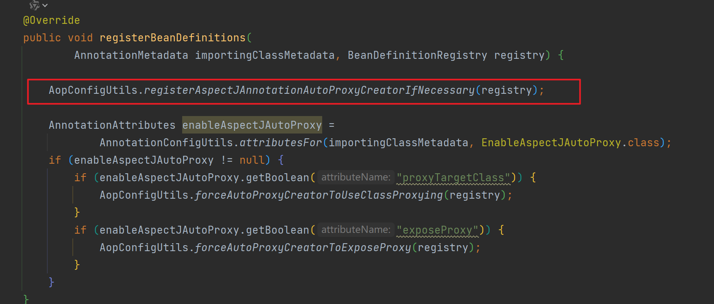
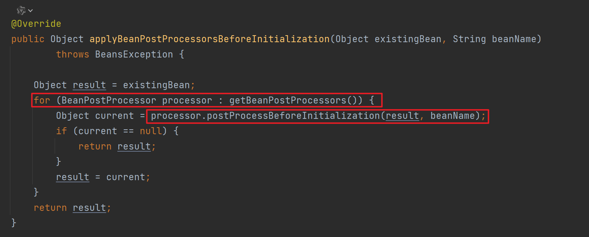
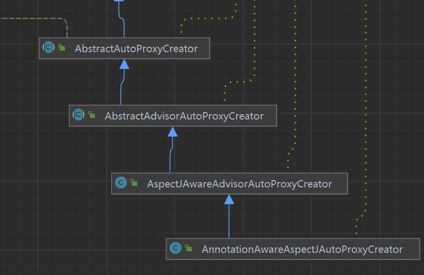
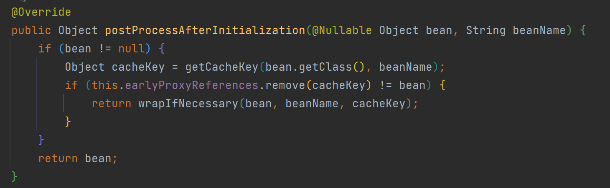
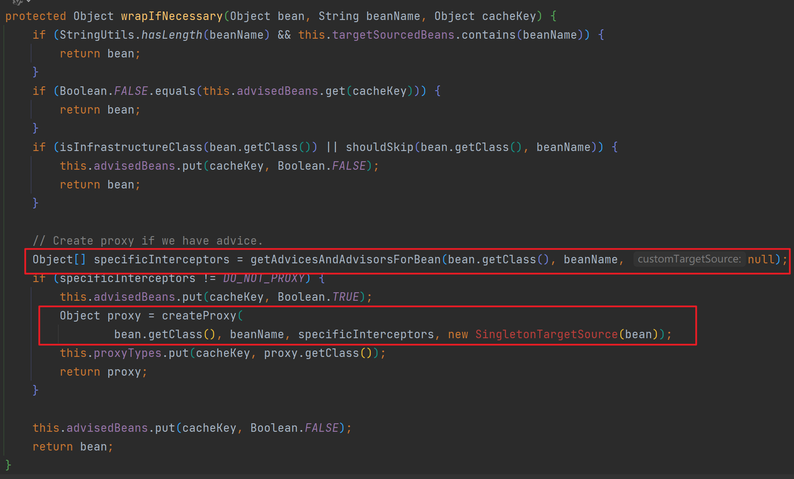
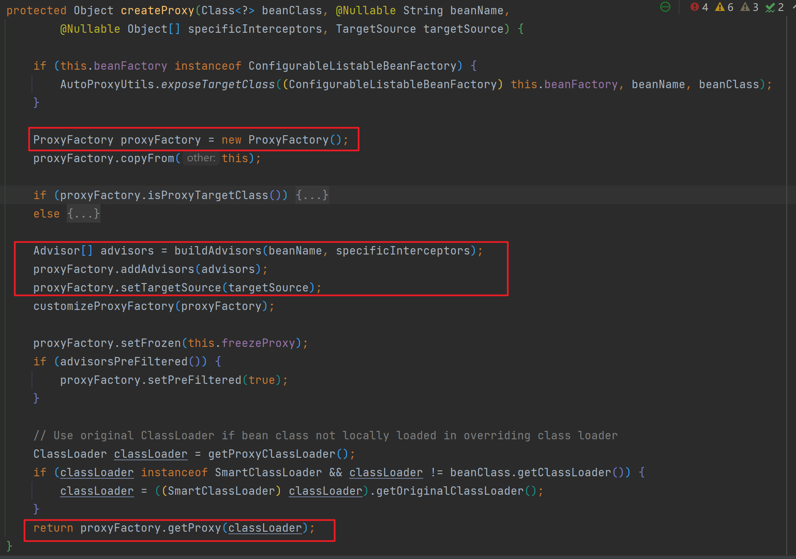

# SpringBoot的AOP代理生成流程

主要通过AnnotationAwareAspectJAutoProxyCreator类后置处理器，在bean生命周期的初始化阶段，后置处理器处理时生成AOP代理

@EnableAspectJAutoProxy注解中通过@Import导入**AspectJAutoProxyRegistrar**类

在AspectJAutoProxyRegistrar类中注册**AnnotationAwareAspectJAutoProxyCreator**后置处理器

在Bean的初始化阶段会根据各后置处理器进行处理，其中通过AnnotationAwareAspectJAutoProxyCreator 调用 postProcessBeforeInitialization()方法获取AOP代理对象

AbstractAutowireCapableBeanFactory类中的方法：

AnnotationAwareAspectJAutoProxyCreator 并没有实现postProcessBeforeInitialization()，实则调用的**AbstractAutoProxyCreator**类的方法

wrapIfNecessary()方法中的createProxy()方法，就是使用ProxyFactory创建的AOP代理对象

