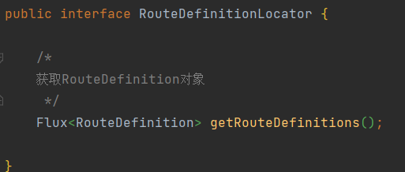
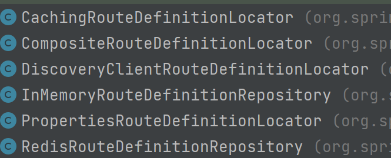
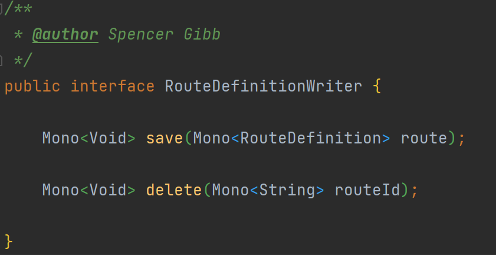
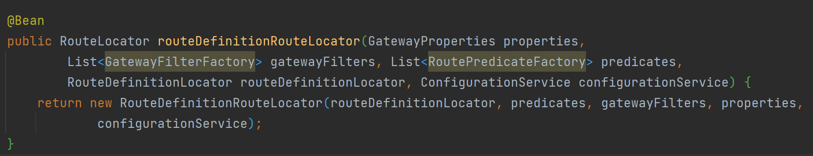
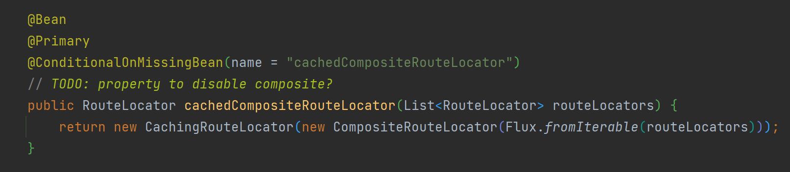
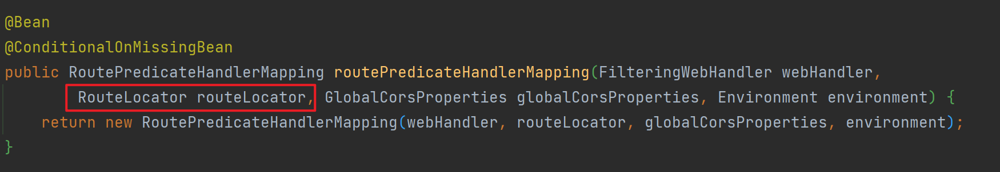

# SpringCloudGateway

## 路由装配过程

> 路由配置主要使用yml配置文件和编码两种形式，在实际使用中，这种静态方式的路由配置可能无法满足需求，需要实现动态路由；
>
> 从路由装配的过程看看能否实现动态路由

静态路由的配置对象`RouteDefinition`

项目启动，加载`GatewayAutoConfiguration`时，注册一个`PropertiesRouteDefinitionLocator`类将网关配置文件信息加载到内存中

`PropertiesRouteDefinitionLocator`是`RouteDefinitionLocator`的一个实现类;`RouteDefinitionLocator`接口定义了获取路由定义信息的方法

`RouteDefinitionLocator`的实现类如下：

- `CachingRouteDefinitionLocator` 一个RouteDefinitionLocator包装类，将RouteDefinition缓存在ConcurrentHashMap中
- `PropertiesRouteDefinitionLocator` 如上所述，从配置文件中获取RouteDefinition

- `DiscoveryClientRouteDefinitionLocator` 从注册中心获取服务实例，构造RouteDefinition

- `InMemoryRouteDefinitionRepository`和`RedisRouteDefinitionRepository` 都是间接实现RouteDefinitionLocator，这两个类拥有save和delete方法，更新存放在自己属性中的路路由信息，是实现动态路由的关键之一
- `CompositeRouteDefinitionLocator` 也是一个RouteDefinitionLocator包装类，组合所有RouteDefinitionLocator，用其getRouteDefinitions方法统一提供RouteDefinition

接下去看配置类的加载内容：

InMemoryRouteDefinitionRepository使用了@ConditionalOnMissingBean注解，那我们可以通过直接注入RouteDefinitionRepository类的实例来实现对路由配置的增加和删除

CompositeRouteDefinitionLocator 使用@Primary注解，在其他需要注入RouteDefinitionLocator类的地方，会优先使用改类，也就达到了统一提供getRouteDefinitions方法的目的

来看一下`InMemoryRouteDefinitionRepository`类 可以做什么

通过save和delete方法，维护保存在routes属性中的RouteDefinition信息

save和delete方法来自`RouteDefinitionWriter`接口，由RouteDefinitionRepository继承

现在如何对路由配置进行增加删除的入口已经找到，那如何实现动态，继续查找配置

`RouteDefinitionRouteLocator` `RouteLocator`的实现类之一

从接口方法中可以知道，该类是用来生成Route，查看实现类

来看一下具体做了啥

获取了 路由定义定位器（RouteDefinitionLocator），过滤器工厂和断言工厂，用于生成Route；

继续查看配置类：

注册了`CachingRouteLocator` 一个RouteLocator的包装类，和RouteDefinitionLocator的处理类似，统一提供Routes，该类是实现动态更新的关键

看一下具体内容：

该类还是一个监听器，实现了ApplicationListener，监听RefreshRoutesEvent事件

监听到事件后，会做何处理：

监听到事件后，调用 fetch()或fetch(Map<String, Object> metadata)方法，方法内部使用`RouteLocator`重新获取Route，RouteLocator又是通过`RouteDefinitionLocator`获取RouteDefinition，也就是能从`RouteDefinitionRepository`的实现类中（InMemoryRouteDefinitionRepository、RedisRouteDefinitionRepository后者我们自定义的实现类）重新获取维护着的RouteDefinition信息

重新获取到的Route，调用publishRefreshEvent方法，更新cache

至此，使用该事件发布订阅机制就可以实现动态的更新CachingRouteLocator中的Route信息

Gateway中通过RoutePredicateHandlerMapping类，在其中由属性RouteLocator获取Route的断言遍历匹配exchange，将route存入exchange，然后交给后续的FilteringWebHandler，匹配相应的过滤器执行相应内容；

CachingRouteLocator 使用@Primary注解，所以RoutePredicateHandlerMapping拿到的就是CachingRouteLocator类，CachingRouteLocator是装配形成Route的最后一个环节，通过该类更新路由信息就可以实现动态路由

使用该事件发布订阅机制实现动态更新路由的大致步骤：

1、自定义实现RouteDefinitionRepository接口

2、根据需求使用数据库、缓存等，实现getRouteDefinitions、save、delete方法

3、更新操作完成后，发布一个RefreshRoutesEvent事件